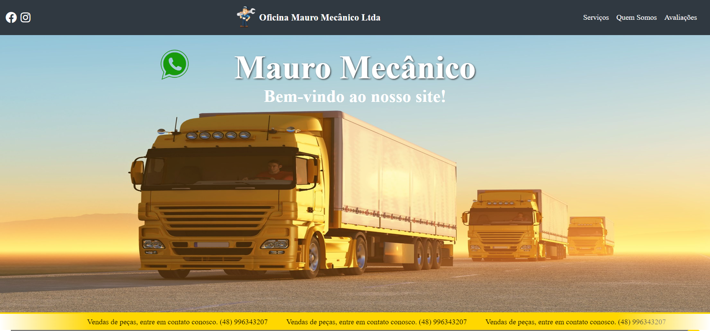
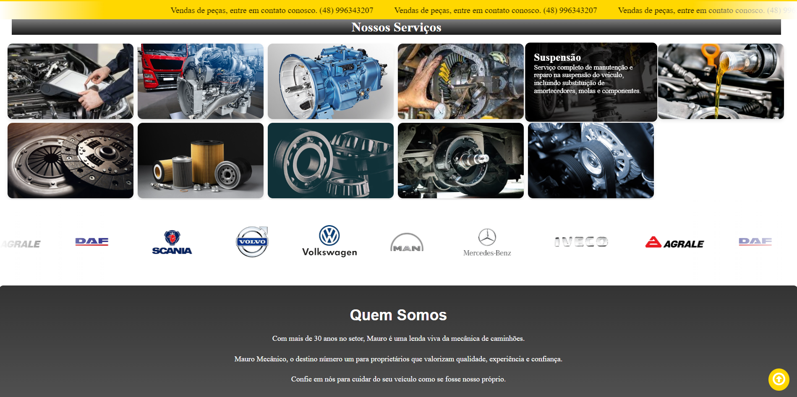

# Mauro Mecânico - Site de Serviços Automotivos

Veja o projeto em ação [aqui](https://site-mauro-mecanico.vercel.app/).

## Descrição
**O Mauro Mecânico é um site desenvolvido para promover os serviços automotivos oferecidos pela oficina Mauro Mecânico. O site foi criado com o objetivo de fornecer informações sobre os serviços, a localização da oficina, depoimentos de clientes e outras informações relevantes para os usuários.** 

## Contribuição
- Contribuições são bem-vindas! Se você deseja contribuir para o projeto, siga as etapas abaixo:

### 1. Clone o Repositório

- Para começar, clone este repositório para o seu ambiente local. Para clonar, abra o terminal ou prompt de comando e execute o seguinte comando:

```bash
git clone https://github.com/seu-usuario/nome-do-repositorio.git
```

### 2. Abrir o Projeto no Visual Studio Code
- Após o clone, navegue até a pasta do projeto usando o comando cd:
```bash
cd nome-do-repositorio
```
### 3. Em seguida, abra o projeto no Visual Studio Code com o comando:
```bash
code .
```
 ### 4. Crie uma Branch
 ```bash
git checkout -b feature/SuaFeature
```
### 5. Faça Commit das Alterações
```bash
git commit -m 'Adicionar nova funcionalidade'
```
### 6.Faça push para a branch
```bash
git push origin feature/SuaFeature
```
### 7. Abra um Pull Request
- Vá para a página do repositório no GitHub
- Clique no botão "Pull Requests"
- Clique no botão verde "New pull request"
- Selecione sua branch com as alterações
- Descreva suas alterações e clique em "Create pull request"

Agora você está pronto para começar a contribuir para o projeto! Obrigado pela sua colaboração.

### Autor
**Nome:** Lucas Carneiro dos Santos

**E-mail:** carneirolucas88@gmail.com

**LinkedIn:** www.linkedin.com/in/carneirolucas/






